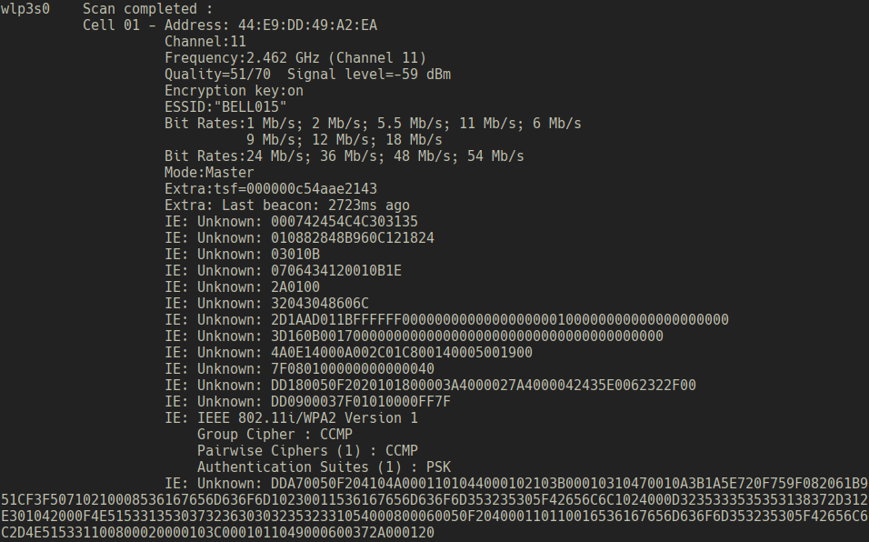
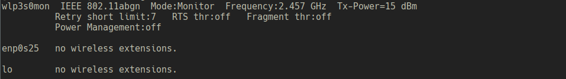

#Cracking WPA2 Passphrases with Aircrack-ng and Kali Linux

## Introduction
In this tutorial, we'll be looking at how to crack WPA/WPA2 networks with Pre-Shared Keys (PSK) using aircrack-ng on Kali Linux. WPA and WPA2 (Wifi Protected Access/2) are security protocols used to secure wireless computer networks. For more information about WEP, WPA, WPA2, and their vulnerabilities, check out [this](http://www.hsc.fr/ressources/articles/hakin9_wifi/hakin9_wifi_EN.pdf) document.

## What We'll Need
- Wireless interface compatible with aircrack-ng. ([instructions](http://aircrack-ng.org/doku.php?id=compatible_cards))
- Live Kali Linux USB ([instructions](http://docs.kali.org/pdf/articles/kali-linux-live-usb-install-en.pdf))
- A test network (on my router, I had more success on the 2.4GHz band than 5GHz)

## Overview
The attack is made possible because of how WPA2 implements it's authentication handshake. One step in particular, the "four-way handshake", provides an opportunity for others to attempt to crack the pass phrase. Because of this, we'll need to see this authentication handshake and also need to determine the following information:

- Client MAC address (MAC of machine authenticating to network)
- BSSID: Access Point (AP) MAC address
- ESSID (network name)
- AP channel
- Name of wireless interface

## Procedure
### Step 1 - Find our access point
To begin, we need to know the name of our wireless interface. This is done by issuing the `airmon-ng` command. From this, we see that my wireless card is named `wlp3s0`.

<!-- airmon-ng -->

Next, we'll have a look at what APs our machine can see by running the following command:

`iwlist wlp3s0 scanning`

This produces a list of networks of the following format. We'll find the one we've set up for testing:

From this, we can get the AP's ESSID, BSSID, and channel.

### Step 2 - Configure our interface
We'll start our card in monitor mode by running the following command:

`airmon-ng start wlp3s0 11`

This starts our wireless interface (wlp3s0) in monitor mode on channel 11. We can verify this configuration by having a look at the output of iwconfig.

### Step 3 - Capture a handshake
As previously mentioned, we need to capture the four-way handshake in order to attempt to crack the password. We'll do this with airodump-ng which will require the information we acquired in the previous steps. The command is as follows:

`airodump-ng --channel 11 --bssid 44:E9:DD:49:A2:EA --write handshake wlp3s0mon`

--channel and --bssid are the channel and bssid of the access point, --write specifies the file prefix of the output files, and wlp3s0 is our wireless interface. Now our terminal looks like this:

There are two ways we can proceed: wait for a device to connect to the AP or disrupt a currently connected device and capture the handshake during its (hopeful) reconnection.

#### Disrupting a connection
This step is optional and will only work if there are clients already connected to the AP. To de-authenticate a client, we'll need to know it's MAC address and the BSSID of the AP to which it's connected. We're looking for stations connected to the BSSID we found in Step 1 which can be found in the airodump-ng output under STATION and BSSID respectively. Now, in a new terminal window, enter the following command:

`aireplay-ng --deauth 1 -a 44:E9:DD:49:A2:EA -c C0:EE:FB:32:15:91 wlp3s0mon`

After successfully capturing a handshake, we'll notice a change in top-right corner of the airodump-ng output.

<!-- after airodump-ng handshake -->

Now we have all the information we need to begin our attempts at cracking this passphrase.

### Step 4 - Cracking the passphrase
To crack the passphrase, we'll need a list of candidate passwords known as a dictionary or word list. Kali Linux has some word lists by default located in `/usr/share/wordlists` but these come from different sources and each list may be best formatted for specific tasks. For more information on finding or generating word lists, have a look at [this page.](http://www.aircrack-ng.org/doku.php?id=faq&DokuWiki=sn0m2t79i3a49a61b481m4lmq4#where_can_i_find_good_wordlists)

After choosing a wordlist, we can begin attempting to crack the passphrase. In a new terminal window, enter the following command:

`aircrack-ng -w word.list handshake.cap`

And we wait.. depending on the word list and passphrase, this can take a while. If the passphrase isn't in the word list, we'll generally be presented with the following output:

<!-- passphrase fail -->

If this is the case, we'll need to find better word lists and try again until we're successful. It's worth nothing that this may not be feasible depending on the length of the passphrase or quality of word lists. However, if we do succeed, this is what the output should look like:

<!-- success -->

